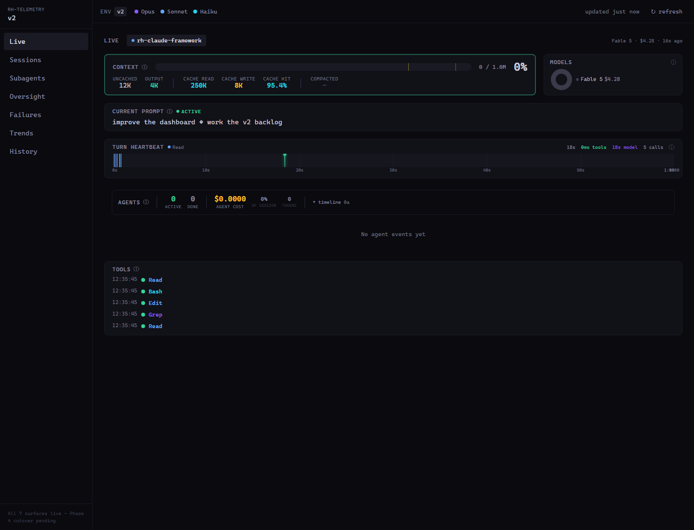
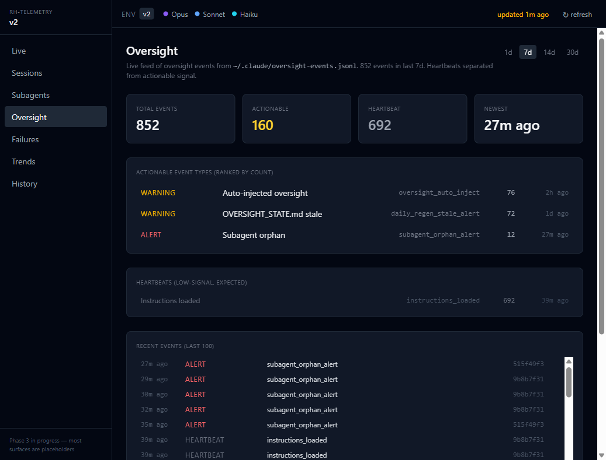
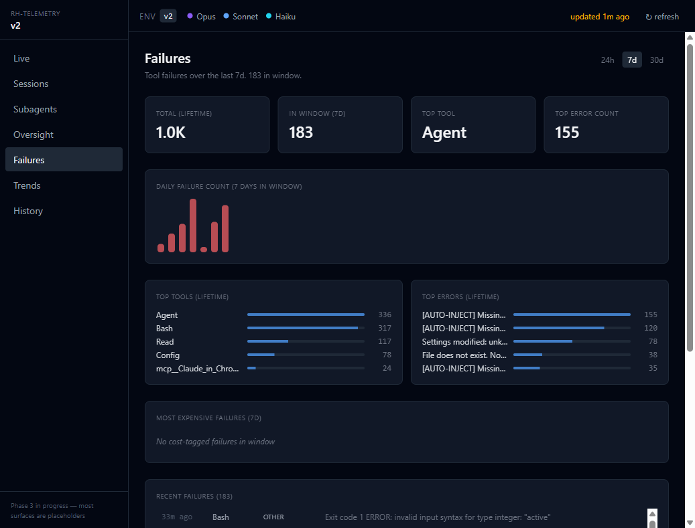

# rh-claude-framework

A real-time telemetry dashboard for Claude Code — live monitoring of context, cost, tool activity, subagents, and failures across sessions — with an optional oversight layer (enforcement hooks, specialist agents, and workspace rules) on top. Packaged as an installable monorepo.

## Why this exists

Claude Code is powerful but opaque at scale — sessions run up cost, burn context, spawn subagents, and hit failures with little real-time visibility. The **telemetry dashboard** makes all of it observable live: context-window fill, per-turn cost and tool activity, active subagents, and a cross-session failure feed.

That visibility also surfaces the *silent* failures — the ones a session that "worked" still hides:
- Read only the first 400 lines of an 800-line source file and called it "incorporated"
- Dispatched a subagent with no completeness requirements — and silently passed through its unverifiable output
- Written a "comprehensive synthesis" document with no way to audit which sources were actually read
- Captured no learnings, recommendations, or cleanup items when the session closed

When you want to *enforce* against those, the **optional oversight layer** adds hooks, rules, and agents that catch them in the act. Both halves are portable and installable in under a minute.



> The bundled telemetry dashboard, watching a live Claude Code session: context-window fill, the current prompt, per-turn tool activity, and active subagents — updated in real time over WebSocket.

## What you get

| Component | What it does |
|---|---|
| **10 enforcement patterns** | Guard, Auto-Inject, Audit, Stop Pipeline, Verification Token, Scribe, Atomic Writer, Supervisor Preload, Self-Test, Zero-Path. See [`docs/PATTERNS.md`](docs/PATTERNS.md). |
| **25 hook scripts** | PreToolUse guards, PostToolUse auditors, multi-stage Stop pipeline, SessionStart preloaders. Wired into `~/.claude/settings.json`. |
| **19 specialist agents** | Facilitator, supervisor, source verifier, scribe (multiscope), pdf-extractor, security specialist, and more. |
| **12 workspace rules** | Completion standards, context discipline, read integrity, subagent oversight, work verification, and others — loaded via `CLAUDE.md` hierarchy. |
| **`rh-oversight` CLI** | Install, self-test, health check, settings merge/validate/backup, cross-session supervisor sweep. |
| **Telemetry dashboard** | Real-time monitoring of hook events, enforcement blocks, subagent patterns, and session trends. React + Recharts. |
| **460 tests** | Oversight (197), CLI (62), output (201). Self-test: 37/37 hard pass on every install. |

## Install

**Prerequisites:** [git](https://git-scm.com/), **Node.js ≥ 18**, and [Claude Code](https://claude.com/claude-code) installed (the framework installs into its `~/.claude/`). On Windows, if your clone path is deep or contains spaces, enable long-path support once: `git config --global core.longpaths true`.

```bash
git clone https://github.com/toolbeltross/rh-claude-framework
cd rh-claude-framework
npm install
node packages/cli/bin/rh-oversight.js init --workspace /path/to/your/workspace
```

`init` does:
1. Writes `~/.claude/oversight.json` (workspace + oversight-dir + telemetry port)
2. Copies `rh-*` enforcement scripts → `~/.claude/scripts/`
3. Copies `rh-*` agent definitions → `~/.claude/agents/`
4. Copies `rh-*` skill definitions → `~/.claude/skills/`
5. Copies workspace rules → `<workspace>/.claude/rules/`
6. Merges hooks into `~/.claude/settings.json` (additive — preserves your existing entries by matcher)
7. Writes a starter `<workspace>/CLAUDE.md` if one doesn't exist

Flags: `--dry-run`, `--skip-hooks`, `--oversight-dir <path>`, `--yes`/`--no-prompt`.

`--oversight-dir <path>` sets where the locally-specific oversight files are read/written — the design doc (`OVERSIGHT_SYSTEM.md`), the generated `OVERSIGHT_STATE.md`, and the supervisory log. If you omit it on an interactive (TTY) run, `init` **prompts** for it, suggesting the autodetected default (`~/.claude/oversight`); on non-interactive runs (CI, piped, headless) it uses that default silently. Pass `--yes` (alias `--no-prompt`) to accept defaults without prompting. The chosen value is written to `oversight.json` and merge-preserved across re-runs.

> `npm install` also builds the telemetry dashboard bundles via the root `prepare` script. This needs devDependencies (Vite), so **do not run `npm install --omit=dev` / `npm ci --omit=dev`** — the `prepare` build will fail with `'vite' is not recognized`. Use a plain `npm install`. See **Telemetry dashboard** below.

> **Hitting setup snags** (npm skipping postinstall scripts, or keeping oversight content in an external repo)? See [`docs/INSTALL-NOTES.md`](docs/INSTALL-NOTES.md).

## Telemetry dashboard

The dashboard is built automatically on `npm install` (root `prepare` → `build:dashboard`, which builds both the v1 and v2 bundles). Start the server:

```bash
node packages/telemetry/server/index.js                       # v1 UI → http://localhost:7890
RH_TELEMETRY_UI=v2 node packages/telemetry/server/index.js     # v2 UI (launch-time selection)
```

**Oversight event feed** — every enforcement signal (auto-injections, stale-state alerts, subagent-orphan alerts) in one ranked stream, separated from low-signal heartbeats:



**Failure patterns** — tool failures aggregated across sessions, with top tools, top error classes, and a daily trend:



To rebuild manually after frontend changes:

```bash
npm run build:dashboard                       # both bundles, from the repo root
# or, inside packages/telemetry:
npm run build        # v1 → dist/
npm run build:v2     # v2 → dist-v2/
```

> Global install (`npm install -g rh-telemetry`) is **planned once the package is published to npm** — it is not published yet. Use the clone path above until then.

## Verify

```bash
node packages/cli/bin/rh-oversight.js self-test
# → oversight-self-test: 37/37 hard passed
```

## Quick tour

**An Agent dispatch without oversight requirements gets auto-corrected:**
```
[PreToolUse:Agent] oversight_auto_inject — appending canonical block to prompt
  missing: verification tokens, context report
```
The subagent sees the requirements as part of its own prompt. The parent never had to write them.

**A consolidation document missing a Source Registry gets blocked:**
```
[PreToolUse:Write] consolidation_blocked — MASTER_ANALYSIS.md
  reason: missing Source Registry with verification tokens
```
Claude self-corrects in the same turn by adding the registry.

**At session end, `/rh-quit` drains the session in one LLM pass:**
- Recommendations → `recommendations.md`
- Cleanup items → `cleanup.md`
- Learnings → `~/.claude/memory-shared/learnings/<topic>.md`

Target wall-clock: < 90s for a typical session.

## Packages

| Package | npm name | Purpose |
|---|---|---|
| [`packages/shared`](packages/shared/) | `@rh/shared` | Canonical config + cross-process file lock + env helpers |
| [`packages/oversight`](packages/oversight/) | `rh-claude-oversight` | Enforcement scripts, agents, workspace rules |
| [`packages/output`](packages/output/) | `@rh/output` | Rendered artifacts (HTML dashboards, scribe writers, daily-regen) |
| [`packages/skills`](packages/skills/) | `@rh/skills` | User-invocable skills (`/rh-quit`, `/rh-session`) |
| [`packages/cli`](packages/cli/) | `@rh/cli` | Meta-installer + `rh-oversight` CLI + settings tooling |
| [`packages/telemetry`](packages/telemetry/) | `rh-telemetry` | Real-time monitoring dashboard |

## CLI subcommands

| Command | Purpose |
|---|---|
| `rh-oversight init` | Install / re-deploy framework artifacts |
| `rh-oversight reset` | Reinstall while preserving `oversight.json` |
| `rh-oversight self-test` | Health check — 37/37 hard pass expected |
| `rh-oversight health [--json]` | One-screen aggregator (regen + journals + telemetry + alerts + scribe backlog) |
| `rh-oversight generate-state` | Regenerate `OVERSIGHT_STATE.md` |
| `rh-oversight settings <sub>` | Merge-aware CLI for `settings.json`: `validate / show / diff / merge / backup / restore` |
| `rh-oversight supervisor-sweep [--days N]` | Cross-session trend doc — reads 7-day event window, writes `supervisor-trends.md` |
| `rh-oversight status [--json]` | One-screen "is the full system on?" readout: oversight hooks, telemetry hooks + server reachability, Postgres shadow state |
| `rh-oversight db-init` | Bootstrap the optional local Postgres FTS shadow (role/db + schema + pgpass + flags + verify). Needs a superuser once via `PGPASSWORD`/`--superuser-password` |
| `rh-oversight ingest-logs [--full]` | Backfill supervisory-log + oversight-events + telemetry-failures into the FTS DB |
| `rh-oversight ingest-transcripts` | Backfill session transcripts into the FTS DB |

## Architecture

- **Monorepo** — npm workspaces with 6 packages: `shared`, `oversight`, `output`, `skills`, `cli`, `telemetry`.
- **Zero hardcoded user paths** — all references parameterized through `@rh/shared/config`. Enforced by a CI regression test (`packages/cli/tests/test-no-identity-refs.js`) that fails the build if any absolute home path leaks into `packages/`.
- **CommonJS** throughout (`require()`); telemetry is the single ESM exception.
- **Config priority**: env var > `~/.claude/oversight.json` > auto-detect (walk up from CWD looking for `.claude/rules/`).
- **Security split**: `rh-security.md` (framework base) + `rh-security-local.md.template` (user's private dirs, gitignored at install time).
- **Cross-process file locking**: `@rh/shared/file-lock` provides atomic O_EXCL lockfiles with PID stamping + 5s stale recovery. Used by all output writers and scribe table writes.
- **Per-turn scribe staging** (on by default): prefilter writes per-turn JSONL to `~/.claude/scribe-staging/`; `/rh-quit` consumes the full staging file instead of the 10K-char transcript tail. Disable with `scribeStaging: false` in `~/.claude/oversight.json` or `RH_SCRIBE_STAGING=0`.

## Development

```bash
# Tests by package
node packages/oversight/tests/run.js   # 197 tests
node packages/cli/tests/run.js         # 62 tests
node packages/output/tests/run.js      # 201 tests (incl. 16-way concurrent stress)

# All workspaces
npm test

# Dry-run install (no filesystem writes)
node packages/cli/bin/rh-oversight.js init --dry-run

# Real install against tmp HOME (outer-seam verification)
HOME=/tmp/test USERPROFILE=/tmp/test \
  node packages/cli/bin/rh-oversight.js init --workspace /tmp/test-ws
```

See [`docs/PATTERNS.md`](docs/PATTERNS.md) for the design rationale behind each enforcement mechanism.

## License

MIT
