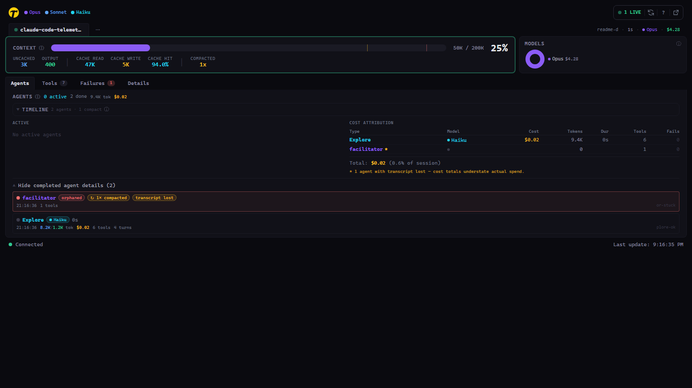
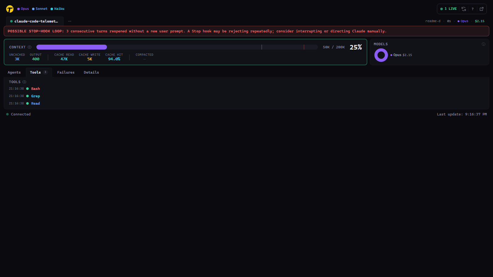
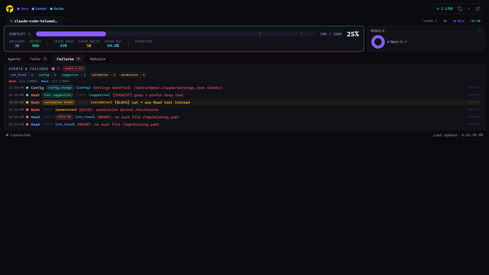
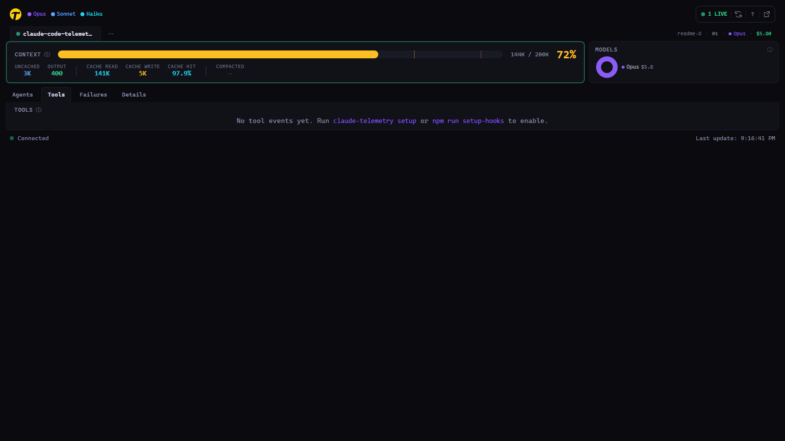
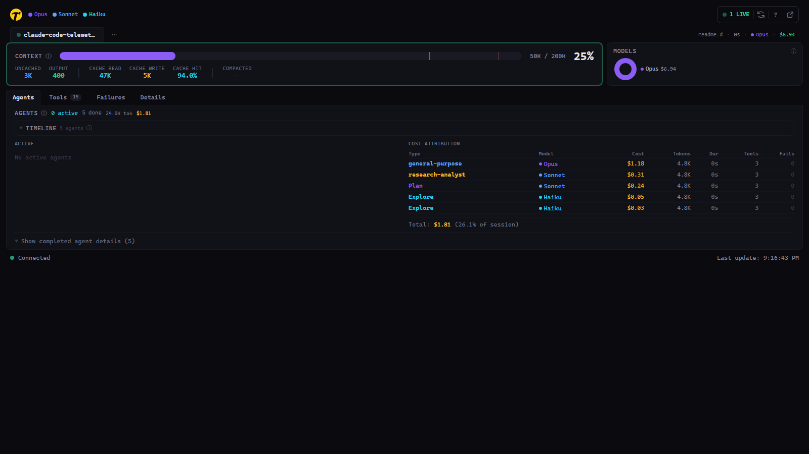
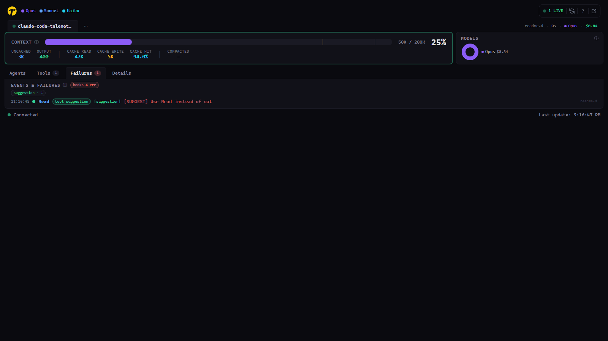

# Claude Code Telemetry Dashboard

Real-time oversight of a Claude Code session — built for catching the failure modes Claude Code itself doesn't surface.

## What this catches that Claude Code hides

Each panel on the dashboard corresponds to a specific phenomenon that the Claude CLI either doesn't show you, or shows only after the damage is done. The list below is phenomenon-led: what goes wrong, how the dashboard lets you see it, and why you'd care.

### Subagent silently orphaned after compaction



**What you're looking at.** The Agents tab shows one lane per subagent spawned by Claude. Active agents have a green pulsing dot; agents that haven't emitted `SubagentStop` but also haven't fired a tool event in >10 minutes get a red "likely orphaned" badge. Agents whose lifetime spans a compaction event carry a `↻ Nx compacted` chip.

**What's actually happening under the hood.** When Claude Code compacts the conversation mid-session, the post-compaction parent sometimes loses track of a running subagent — the child never emits `SubagentStop`, so the parent's handle becomes a dangling reference. From the Claude CLI you see nothing; the agent is just… gone.

**Why it matters.** Without this panel you'd assume the agent finished its work. In reality nothing returned, and you're still waiting. The dashboard catches it within minutes and surfaces it on both the Agents tab and the Events & Failures tab as a persistent row.

### Stop-hook rejection loops



**What you're looking at.** When a Stop hook (e.g. a supervisor LLM reviewing Claude's last turn) returns `{ok: false}`, Claude is forced to continue. Each time that happens without a new user prompt intervening, the dashboard counts it as a "forced continuation." One: amber badge. Two or more in a row: red "Possible Stop-hook loop" banner recommending you interrupt or direct manually.

**What's actually happening under the hood.** The supervisor decision is consumed by Claude Code internally — neither the `{ok, reason}` JSON nor the reason text is observable to anything outside the hook. We detect the pattern indirectly: a `Stop` event followed by tool events with no `UserPromptSubmit` in between.

**Why it matters.** A stuck supervisor can drain budget fast and feel like Claude is just "thinking" — but really the turn is reopening again and again. The red banner tells you to interrupt, give Claude fresh guidance, or review the hook logic.

### Events the Claude CLI never surfaces



**What you're looking at.** The Events & Failures tab unifies five event classes into one persistent log: tool failures (red), validation blocks (amber), tool-use suggestions (green), config-file changes (cyan), orphaned agents (purple). Error-class chips at the top (`not_found · 3`, `permission · 2`, …) let you see the shape of the problem without reading each row. Retry badges nest identical-input failures under the original.

**What's actually happening under the hood.** Claude Code emits hook events for these phenomena but doesn't persist them anywhere the user can see. Config drift ("why did my hooks stop working?") is invisible. A Bash call blocked by the Layer 1 validator is silently rejected. Three identical `ENOENT`s in a row are three separate rows in your transcript with no indication they're the same thing.

**Why it matters.** Config drift is the #1 cause of hook breakage. Repeated-same-input failures mean the oversight system isn't correcting the agent. Error-class grouping lets you say "this session had 5 permission errors — something changed on disk" in one glance.

### Context pressure and cache churn



**What you're looking at.** Token fill gauge + runway estimate (turns remaining at current velocity) + cache-hit ratio. The gauge turns amber at 80%, red at 90%.

**What's actually happening under the hood.** Every assistant turn reads the entire conversation history. Past ~70% of the window, quality starts degrading and the CLI increasingly spends tokens re-processing older content rather than generating new output. Cache hit ratio tells you how much of that re-processing is cheap (cache hit) vs. expensive (cache miss, full re-encode). A dropping cache hit ratio means the session is about to get expensive fast.

**Why it matters.** Once the cache starts missing, compaction is imminent — and compaction is when orphan-subagent bugs hit (see above). You want to know.

### Cost the Claude UI never discloses



**What you're looking at.** ModelBreakdown donut splits total session cost by model family — Opus (purple), Sonnet (blue), Haiku (cyan). The Agents tab cost attribution table shows per-subagent spend (including subagents marked with `*` whose transcript was lost, meaning total underreports reality). TurnCostChart traces per-turn cost over time so spikes jump out.

**What's actually happening under the hood.** When Opus dispatches an Explore subagent, the subagent typically runs on Haiku — cheaper, but invisible to the Claude UI because it reports only the parent model. A single dashboard session often has 3–10 subagents running on a mix of models, and the Claude CLI summary glosses this entirely.

**Why it matters.** Cost attribution is how you decide whether a given pattern of delegation is worth it, and per-turn spikes surface reruns and retry loops before they show up in the monthly bill.

### Repeated failure patterns across sessions


**What you're looking at.** The failure store persists to `~/.claude/telemetry-failures.jsonl` across server restarts. The patterns summary shows class counts, top-cost failures, and retry chains. `GET /api/failures/patterns` and `/api/failures/digest` expose this for scripts.

**What's actually happening under the hood.** The Claude CLI treats each session as isolated — if the same `ENOENT` hits in five different sessions over a week, you'd never know it's a pattern unless you were grepping transcripts by hand.

**Why it matters.** Recurring error classes point at environment issues (a path that keeps changing, a permission that keeps drifting) that are worth fixing once instead of re-debugging each time.

### Hook-forwarder self-health



**What you're looking at.** A green "hooks ok" or red "hooks N err" chip on the Events & Failures tab, auto-polled every 60s. Hover for transcript-parse P95 latency and recent error lines from `hook-debug.log`.

**What's actually happening under the hood.** If the forwarder script breaks (wrong Node path, permission change, log rotation issue), every subsequent hook silently drops on the floor and the dashboard stops updating. Nothing in the Claude CLI would tell you.

**Why it matters.** This is the meta-failure — telemetry is only useful when it's actually telemetering. The chip catches the failure that would otherwise make the rest of the dashboard lie by omission.

> **Note on screenshots**: the images above reference `docs/screenshots/*.png` paths. If you're viewing this repo fresh, those files may not exist yet — you can generate them from a live session by running the dashboard against your own Claude Code use. The captions describe exactly what each panel shows.

## Features (flat list)

- **Context Window** — token fill gauge, runway remaining, velocity, estimated turns left
- **Agent Tracker** — active subagents with type, model, description, elapsed time, failure/block counters, parent linkage, gantt-lite timeline
- **Tool Activity** — live feed of every tool call with timestamps, success/failure dots
- **Events & Failures** — persistent log: failures, validation blocks, suggestions, config changes, orphaned agents; error-class grouping; retry detection; prompt linkage; cost-weighted ranking
- **Turn Tracking** — per-turn cost, velocity, cost chart over time, forced-continuation detection
- **Model Breakdown** — cost per model donut chart
- **Performance Metrics** — CLI frame timing (FPS, p50/p95/p99)
- **Tool Validation** — deterministic tool-usage validation (blocks `cat` when `Read` should be used, suggests alternatives without blocking in other cases)
- **Hook-forwarder Self-Health** — `/api/hook-health` endpoint + chip surfaces when the hook pipeline itself breaks
- **Cross-platform** — works with CLI, VS Code, Desktop, WSL, PowerShell, bash

## Install & Run

Clone the monorepo and install — the dashboard bundles build automatically (root `prepare` script):

```bash
git clone https://github.com/toolbeltross/rh-claude-framework.git
cd rh-claude-framework
npm install                                   # installs deps + builds the dashboard
node packages/telemetry/server/index.js       # serve on http://localhost:7890 (v1 UI)
```

Then open http://localhost:7890 in your browser.

To configure Claude Code hooks + skills (live tool feed, validation, prompt capture, agents):

```bash
cd packages/telemetry
npm run setup-hooks       # configure Claude Code hooks
npm run install-skills    # install /rh-telemetry skill
```

> A global install (`npm install -g rh-telemetry`, then `rh-telemetry setup` / `rh-telemetry start`) is **planned once the package is published to npm** — it is not published yet. Use the clone path above until then.

## Development (live reload)

For frontend work with hot-module reload:

```bash
git clone https://github.com/toolbeltross/rh-claude-framework.git
cd rh-claude-framework
npm install               # installs deps + builds the dashboard
cd packages/telemetry
npm run setup-hooks       # configure Claude Code hooks
npm run install-skills    # install /rh-telemetry skill
npm run dev               # Vite on :5173, API on :7890
```

## v2 frontend (in-flight, opt-in)

A second UI is being built alongside v1. Both ship in the same tarball; pick at runtime via env flag.

```bash
npm run build:v2                        # build the v2 bundle to dist-v2/
RH_TELEMETRY_UI=v2 npm start            # serve v2 instead of v1
rh-telemetry start --ui v2              # same, via the CLI
```

Default is unchanged (v1). See `PLAN-20260520-frontend-v2.md` for scope.

## Requirements

- Node.js 18+
- Claude Code CLI installed

## What `setup` Does

1. **Hooks** — Registers 12 Claude Code hooks in `~/.claude/settings.json`:
   - `SessionStart` — auto-starts the telemetry server in the background
   - `PreToolUse:Bash` — validates tool usage (blocks `cat` when `Read` should be used, etc.)
   - `PostToolUse` / `PostToolUseFailure` — forwards tool events to the dashboard
   - `Stop` — marks turn boundaries
   - `PreCompact` — detects context compaction events
   - `SubagentStart` / `SubagentStop` — tracks agent lifecycle
   - `UserPromptSubmit` — captures what question Claude is answering
   - `ConfigChange` — logs settings modifications
   - `TaskCompleted` — logs task completions
   - `statusLine` — sends live session data (cost, context, model)

2. **Skills** — Installs `/rh-telemetry` and `/rh-telemetry-setup` as Claude Code skills

## Usage

### Web Dashboard

Start the server and open http://localhost:7890:

```bash
rh-telemetry start          # foreground
rh-telemetry start --bg     # background (auto-starts via hooks too)
```

### CLI Queries

```bash
rh-telemetry                # session summary (default)
rh-telemetry sessions       # all sessions sorted by cost
rh-telemetry costs          # cost breakdown by model
rh-telemetry context        # context window details
rh-telemetry activity       # daily activity (last 14 days)
rh-telemetry session <name> # details for a specific project
rh-telemetry status         # check if server is running
```

### Inline Skill

Inside any Claude Code session, type `/rh-telemetry` to get an inline summary without leaving the conversation.

## Architecture

```
~/.claude.json ──┐
                 ├─→ chokidar file watchers → parser → store → WebSocket → React UI
stats-cache.json─┘

Claude Code hooks → hook-forwarder.js → POST to server → store → WebSocket → React UI
```

- **Backend**: Express + WebSocket + chokidar on port 7890
- **Frontend**: React 19 + Vite + Tailwind CSS v4 + Recharts
- **Data**: Reads `~/.claude.json` and `~/.claude/stats-cache.json` (no database)
- **Hooks**: Claude Code hooks POST tool events, prompts, agent activity to the server

## Privacy

The dashboard reads `~/.claude.json` and `~/.claude/stats-cache.json` for session data.
For Max plan usage detection, it reads OAuth credentials from `~/.claude/.credentials.json`
(or macOS Keychain). Credentials are used locally to check plan limits — they are never
transmitted anywhere except Anthropic's API. All data stays on your machine.

## Troubleshooting

**`npm start` not working**
Use `npm run dev` for development or `node server/index.js` directly.

**VS Code panel hooks not firing**
Known Anthropic bug with the graphical panel. Run `claude` in the VS Code integrated terminal as a workaround.

**WSL + Windows dual setup**
Hooks are filesystem-specific. Run `rh-telemetry setup` from both WSL and Windows terminals to cover both environments.

**Server won't start (port in use)**
Another instance may be running. Use `rh-telemetry status` to check, or kill the existing process on port 7890.

## License

MIT